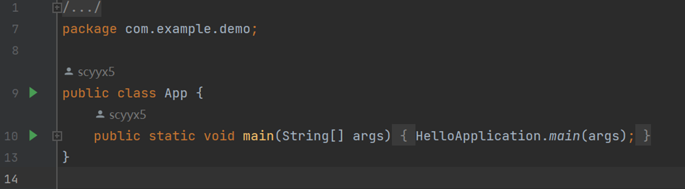
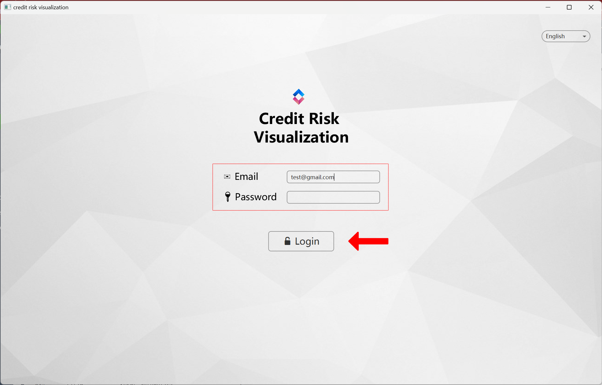
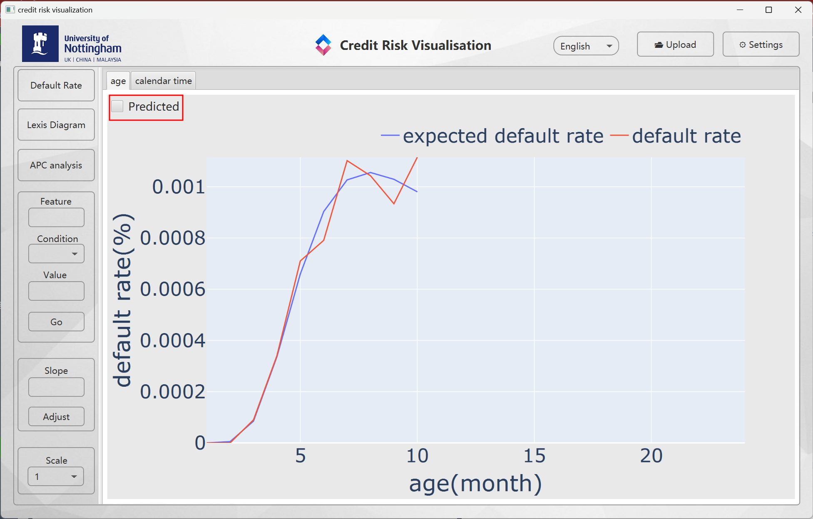
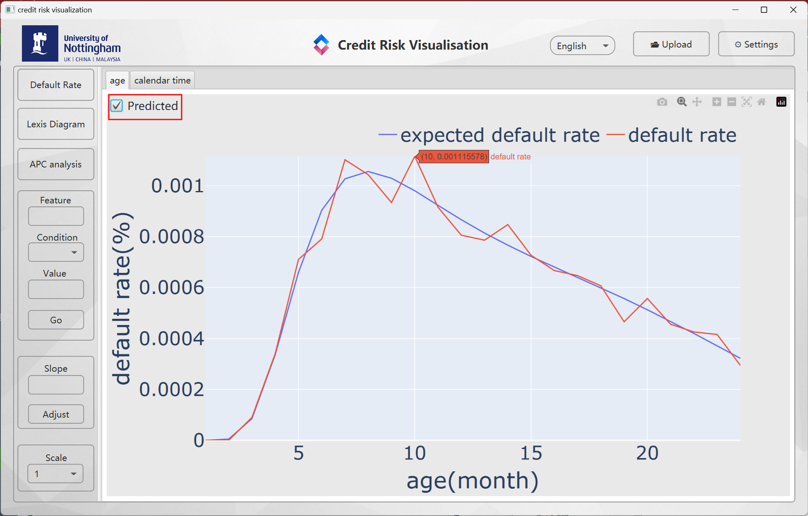
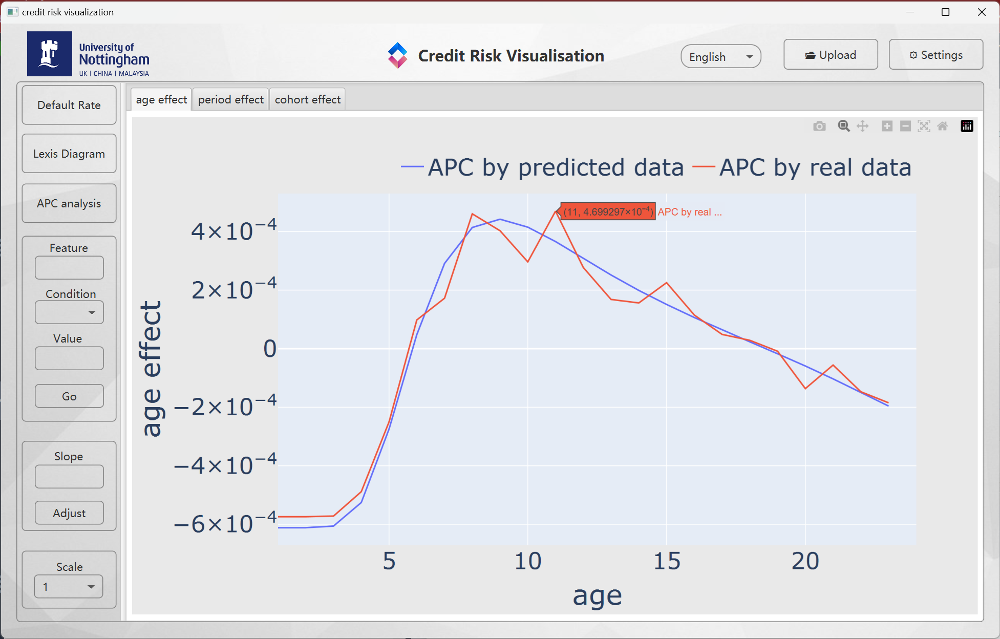
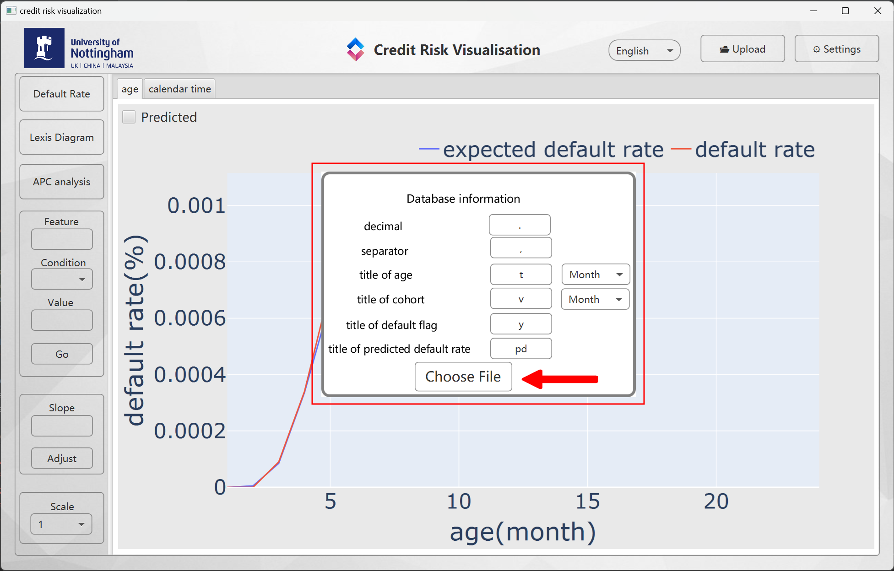
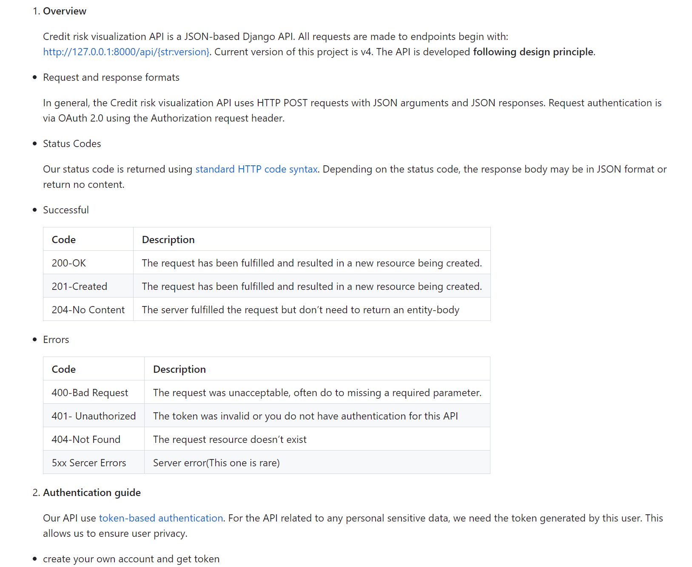
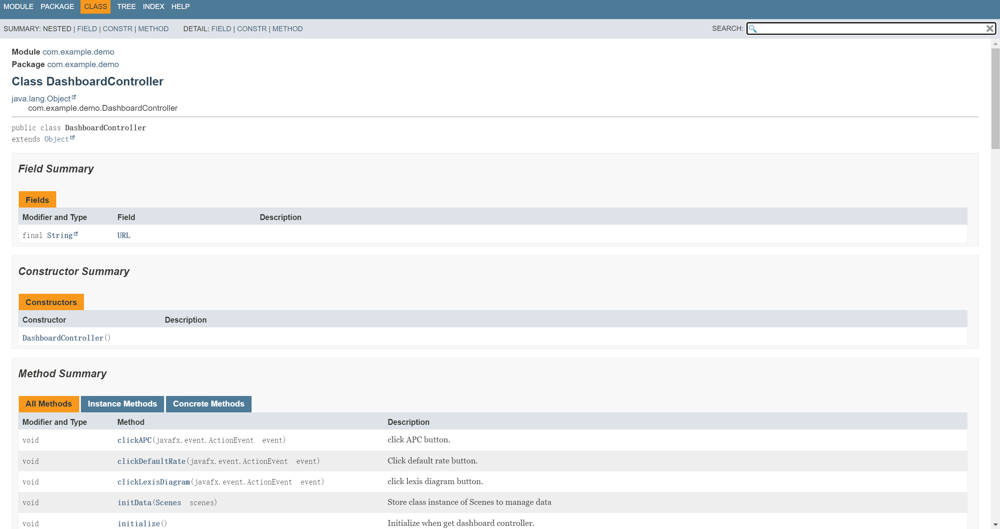
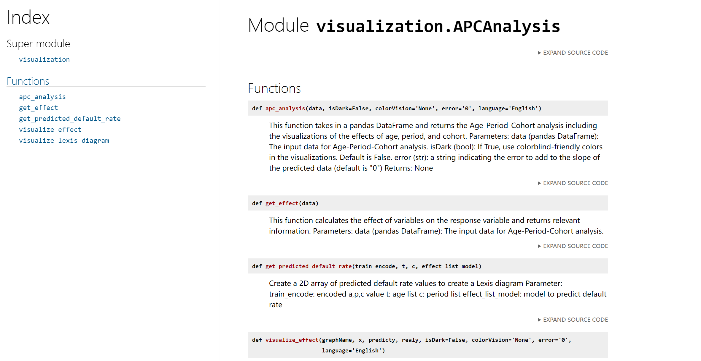

# Visualization and Validation Tool for Credit Risk Models
If you have any questions, please contact the author at anyaxiao0604@outlook.com.
## Introduction
Nowadays, credit risk modelling is widely used in financial institutions. However, no software applications have been developed for loan managers to enhance their understanding and help them utilise the model without statistical analysis background. This project aims to bridge the gap by implementing an application to help loan managers analyse the risk of default and predict potential losses, specifically focusing on default rates and the age-period-cohort (APC) model efficiently predicts default rates. Firstly, age-period-cohort models are implemented to analyse separate effects of default. Then, the tool visualises the default rate and lexis diagram to enhance understanding of the output of dynamic survival model for credit risk management. This project uses two simulation data set and one Freddie Mac mortgage data set to validate the model. 


## User Manual

### Requirements

The application should be installed and run locally. The following requirement should be satisfied to ensure a smooth experience with the application. Because of size limitations, the default dataset is not provided along with the source code, which may result in some problems when executing the application. Please do not hesitate to ask the author for the database if you want to try the application.

#### Hardware

No specific hardware is required for this project. Any computer support *Python* and *Java* could run the application.

#### Software

##### *Python*

*Python* version 3.10.8 or above is recommended. To install external dependencies, navigate to the root directory and enter the command:

```bash
pip install -r requirements.txt
```

The dependencies listed below are used in this project:

| Dependencies | Version |
|--------------|---------|
| *Django* | 4.1.3 |
| *djangorestframework* | 3.14.0 |
| *djangorestframework_simplejwt* | 5.2.2 |
| *drf_yasg* | 1.21.4 |
| *jsonschema* | 4.17.3 |
| *psycopg2* | 2.9.5 |
| *requests* | 2.28.1 |
| *rest_framework_simplejwt* | 0.0.2 |
| *matplotlib* | 3.6.2 |
| *numpy* | 1.23.5 |
| *pandas* | 1.5.2 |
| *plotly* | 5.11.0 |
| *python_dateutil* | 2.8.2 |
| *scikit_learn* | 1.2.2 |

##### *Java*

*Java* JDK version 19.0.1 is required. To install external dependencies, navigate to the root directory and enter the command:

```bash
mvn install
```

Alternatively, use Java IDEs such as IntelliJ IDEA and open the project root directory, following online instructions to install dependencies.

### Getting Started

#### Run backend server

After installing the application and required packages, navigate to `demo/src/backend/mysite` and enter the command `python manage.py runserver`. The server is run successfully when the command line gives the output below:

```bash
\src\backend\mysite> python manage.py runserver
Watching for file changes with StatReloader
Performing system checks...

Register successfully
System check identified no issues (0 silenced).
April 09, 2023 - 11:32:14
Django version 4.1.3, using settings 'mysite.settings'
Starting development server at http://127.0.0.1:8000/
Quit the server with CTRL-BREAK.
```

#### Run interface

To start the JavaFX application, the simplest way is to use Java IDEs like IntelliJ IDEA, navigate to `src/interface/java/com/example/demo/App.java`, and run the App class. For example, click the green "Play" icon.



#### Log in

As shown in the figure below, enter your email and password and click log in to access full functions. You can use the test account here:

- username: test@gmail.com
- password: test123456



Default dataset *simDTS1* will be used to initialise the graphs.

#### Visualization

The default rate, lexis diagram and APC analysis are provided.

By default, the visualisation of the default rate before the current age and calendar time is provided. Real data calculate the default rate, while the expected default rate is the default rate predicted using discrete survival models. The predicted default rate will also be visualised by clicking predicted, as presented in the figures below.





For the lexis diagram, 9 themes are provided. You could simply choose the theme to switch from each other.


For APC analysis, the age effect, period effect and cohort effect are analysed and visualised.



#### Upload personalized dataset

To upload personalised data, click the upload button in the dashboard, and the database information page will pop up as shown below. The default information is provided as shown in the graphs below. Once the related information is finished, click Choose File to find the file in the chooser. After choosing the file, the application will process and visualise the data.



#### Data filtering

To filter the data according to a specific condition, enter filter, condition and value and click go. The data that satisfy the provided condition will be used for visualisation.

#### Slope Adjustment

Slope adjustment is to adjust the slope of APC analysis. Entering the slope and clicking adjust, the age, period and cohort effect diagram will be updated accordingly. The slope of every segment will be adjusted according to the provided information.

#### Scale

Scale, including sinh and exp scales, is provided to enhance the understanding of unusual data distribution. The default rate and APC effect will be scaled.

#### Accessibility

Language changing is provided at the bottom right of the log-in and dashboard page. To access more accessibility functions, click the settings button. Colour vision deficiency, changing font size and dark mode is supported in this stage.


## Documentation

### API Documentation
Documentation is accessible following the guidance below.
- Open `src/docs/API documentation.md` with a markdown renderer such as Visual Studio Code.
- Click [API documentation](https://github.com/scyyx5/my_FYP/blob/main/src/docs/API%20documentation.md). You can ask the author for accessibility.

A screenshot of API documentation is presented in Figure 1.


*Figure 1: Screenshot of API documentation*

### Java Documentation
- Open `src/docs/frontenddoc/index.html` with any browser.
- Click [Java documentation](https://scyyx5.github.io/frontenddoc/).

Figure 2 presents a screenshot of Java documentation.


*Figure 2: Screenshot of Java documentation*

### Python Documentation
- Open `src/docs/visualizationdocs/index.html` for visualization documentation and `src/docs/backenddoc/index.html` for backend documentation with any browser.
- Click [visualization documentation](https://scyyx5.github.io/visualizationdocs/) for visualization documentation and [backend documentation](https://scyyx5.github.io/backenddoc/) for backend documentation.

Figure 3 presents a screenshot of Python documentation.


*Figure 3: Screenshot of Python documentation*


